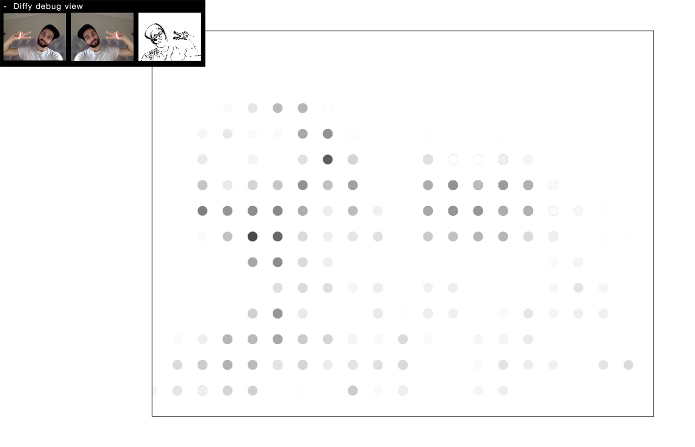

#Diffy.js
### A dependency-free motion detection library for the browser. 
This library came out of my [browser-based interactive experiments](http://maniartstudio.com/#the-night) and from the need to extract motion data from the webcam through the `getUserMedia` API. This is the cleaned up version of that code. Hat tip to [Soundstep](http://www.soundstep.com/blog/2012/03/22/javascript-motion-detection/) for the technique used in this library.	

## Overview
Basically, Diffy.js grabs two consectives webcam snapshots in each tick of the loop (via `requestAnimationFrame`) & combines them into a high contrast blended image to create a "diff image".  This image can be adjusted from the API via `sensitivity` and `threshold` parameters. Based on a `resolution: {x, y}` parameter from the API, Diffy.js will create a matrix containing average values from this image. This matrix is then passed as the only argument to a recursively-executed callback function provided by the user: `onFrame: function(matrix) { /* draw something */ }`. A Web Worker is used to speed up image processing. A simple visual debugger can be optionally turned on as you experiment with values. 

 

<sup>_Screenshot from `demo/:` Raw webcam input, Mirrored raw canvas, "diff" image canvas, a simple canvas experiment with Diffy.js_</sup>


## Installation
npm: `npm install diffyjs --save`

Bower: `bower install diffyjs --save`

Git: `git clone https://github.com/maniart/diffyjs.git`


## Usage

With ES2015 via [Babel](http://babeljs.io/):

```
import { create } from 'diffyjs';

const diffy = create({
  resolution: { x: 15, y: 10 },
  sensitivity: 0.2,
  threshold: 25,
  debug: true,
  onFrame: (matrix) => { /* good things */ }
});
```

With ES5 via `<script>` tag:

```
// HTML: 
// <script src="/path/to/diffy.min.js"></script>

// JS:
var diffy = Diffy.create({
  resolution: { x: 15, y: 10 },
  sensitivity: 0.2,
  threshold: 25,
  debug: true,
  onFrame: function (matrix) { /* good things */ }
});
```

## A few things to keep in mind
- Diffy.js is meant to be used in a Browser environment
- The library will request camera access upon loading of the web page. Choose `Allow` to proceed.
- It also requires [Web Workers](http://caniuse.com/#search=web%20worker). 
- Any hosted project using the `getUserMedia` API (including Diffy.js), [must be served over `HTTPS`](http://stackoverflow.com/questions/34197653/getusermedia-in-chrome-47-without-using-https), but you can easily run it on `localhost`.
- Diffy.js is designed to allow 1 instance on each page. Further instantiation attempts will throw.


## API Reference

#### #create(options)
Creates and returns a Diffy.js instance. It will request camera access as soon as the web page loads and will immediately begin executing the provided callback function.

#####Arguments
```
options (object) {
  resolution (object - defines the size of the output matrix) {	
  	x (number - resolution along the X axis)
  	y (number - resolution along the Y axis)
  },
  sensitivity (number - a decimal value between 0 and 1. It impacts the contrast of the blended image. Somewhere around 0.2 is usually good. yay magic numbers),
  threshold (number - any number between 0 and 255 can be user. but _ahem_ magic numbers are around 20 and 25. Experiment with this. This parameter defines the minimum average value that registes as "movement" for Diffy.),
  debug (boolean - )
  onFrame
}
```

Depending on the size of the project, if it is small and simple enough the reference docs can be added to the README. For medium size to larger projects it is important to at least provide a link to where the API reference docs live.

## Development

## Tests

As of right now, test coverage is [___*covers face*___] embarrassingly low but you can run them via `npm run test` from the project root. New releases will include better test coverage.  

## Contributors

Let people know how they can dive into the project, include important links to things like issue trackers, irc, twitter accounts if applicable.

## Issues

## License

A short snippet describing the license (MIT, Apache, etc.)
